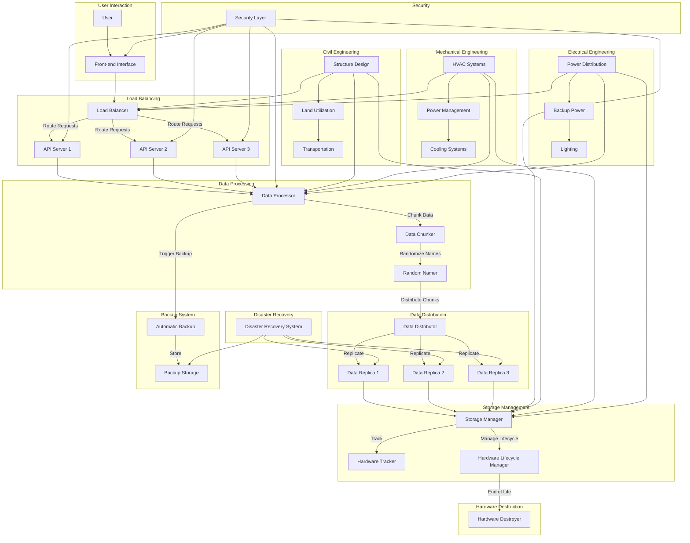

# High-Level Design

```mermaid
graph TD
    subgraph "Civil Engineering"
        CE[Structure Design]
        CE --> LU[Land Utilization]
        LU --> TR[Transportation]
    end

    subgraph "Mechanical Engineering"
        ME[HVAC Systems]
        ME --> PM[Power Management]
        PM --> CS[Cooling Systems]
    end

    subgraph "Electrical Engineering"
        EE[Power Distribution]
        EE --> BP[Backup Power]
        BP --> LT[Lighting]
    end

    subgraph "User Interaction"
        U[User] --> FE[Front-end Interface]
    end

    subgraph "Load Balancing"
        FE --> LB[Load Balancer]
        LB --> |Route Requests| AS1[API Server 1]
        LB --> |Route Requests| AS2[API Server 2]
        LB --> |Route Requests| AS3[API Server 3]
    end

    subgraph "Data Processing"
        AS1 --> DP[Data Processor]
        AS2 --> DP
        AS3 --> DP
        DP --> |Chunk Data| DC[Data Chunker]
        DC --> |Randomize Names| RN[Random Namer]
    end

    subgraph "Data Distribution"
        RN --> |Distribute Chunks| DD[Data Distributor]
        DD --> |Replicate| DR1[Data Replica 1]
        DD --> |Replicate| DR2[Data Replica 2]
        DD --> |Replicate| DR3[Data Replica 3]
    end

    subgraph "Storage Management"
        DR1 --> SM[Storage Manager]
        DR2 --> SM
        DR3 --> SM
        SM --> |Track| HT[Hardware Tracker]
        SM --> |Manage Lifecycle| HLM[Hardware Lifecycle Manager]
    end

    subgraph "Backup System"
        DP --> |Trigger Backup| AB[Automatic Backup]
        AB --> |Store| BS[Backup Storage]
    end

    subgraph "Security"
        SEC[Security Layer] --> FE
        SEC --> AS1
        SEC --> AS2
        SEC --> AS3
        SEC --> DP
        SEC --> SM
    end

    subgraph "Disaster Recovery"
        DR[Disaster Recovery System] --> BS[Backup Storage]
        DR --> DR1
        DR --> DR2
        DR --> DR3
    end

    subgraph "Hardware Destruction"
        HLM --> |End of Life| HD[Hardware Destroyer]
    end

    CE --> LB
    CE --> DP
    CE --> SM

    ME --> LB
    ME --> DP
    ME --> SM

    EE --> LB
    EE --> DP
    EE --> SM
```
